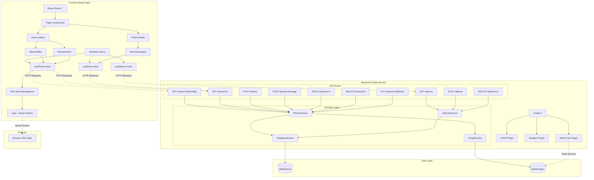

# Gallery Plus

## Overview

**Gallery Plus** is a modern, full-stack photo gallery application designed for photographers, content creators, and anyone who needs a simple solution for organizing and sharing their image collections. 

### What is Gallery Plus?

Gallery Plus combines the power of a React-based frontend with a high-performance Fastify backend to deliver a complete photo management solution.

### Key Characteristics

🎯 **Purpose-Built**: Specifically designed for photo gallery management with features like album organization, advanced search, and intuitive photo navigation

⚡ **Performance-First**: Built with modern tools like React 19, Vite 6, and Fastify 4 for lightning-fast performance and optimal user experience

🔧 **Developer-Friendly**: Clean, well-documented codebase with TypeScript throughout, comprehensive API documentation, and modular architecture

📱 **Mobile-Ready**: Fully responsive design that works beautifully on desktop, tablet, and mobile devices with touch-optimized interactions

🛠 **Self-Contained**: No external database dependencies - everything runs with just Node.js and a simple JSON file for data persistence

🔒 **Type-Safe**: End-to-end type safety with TypeScript, Zod validation, and comprehensive error handling


### Who Is This For?

- **Photographers** who need a simple way to organize and share their work without complex software
- **Content Creators** looking for a lightweight gallery solution that they can customize and control
- **Developers** who want a modern reference implementation of a full-stack TypeScript application
- **Small Businesses** needing a self-hosted image gallery without complex infrastructure costs
- **Learning Enthusiasts** studying modern web development patterns and best practices
- **Agencies** requiring a white-label gallery solution that can be easily branded and deployed

### Perfect Use Cases

✅ **Portfolio Websites**: Showcase your photography or design work with professional presentation

✅ **Event Photography**: Organize photos from weddings, corporate events, or parties into searchable albums

✅ **Product Catalogs**: Display product images with detailed organization and search capabilities

✅ **Family Photo Sharing**: Create a private, self-hosted alternative to commercial photo sharing services

✅ **Educational Projects**: Document classroom activities, field trips, or student work with organized galleries

✅ **Real Estate**: Showcase property photos organized by location, property type, or other criteria

✅ **Development Learning**: Use as a reference for modern React/TypeScript/Node.js application architecture

### What Makes It Special?

Gallery Plus stands out from other photo gallery solutions through several key innovations:

**📊 Smart State Management**: Uses URL-based state persistence, meaning your search queries, filters, and navigation state are preserved in the browser URL - perfect for sharing specific gallery views or bookmarking filtered results.

**🔄 Real-time Search**: Implements debounced search with instant visual feedback, allowing users to find photos quickly without overwhelming the server with requests.

**🎯 Album-Photo Relationships**: Sophisticated many-to-many relationship management where photos can belong to multiple albums, with intuitive UI for managing these associations.

**🚀 Modern Development Stack**: Leverages the latest versions of React 19, React Router 7, and Tailwind CSS 4, providing a cutting-edge development experience with the newest web platform features.

**💰 Zero Infrastructure Costs**: No need for PostgreSQL, MongoDB, or cloud databases - everything runs on the filesystem with automatic JSON database initialization.

### Technical Philosophy

Gallery Plus embodies modern web development principles:

- **Type Safety First**: Full TypeScript implementation with Zod validation ensures runtime safety and excellent developer experience
- **Component-Driven**: Modular React components with clear separation of concerns and reusable design patterns
- **API-Centric Design**: RESTful backend that can support multiple frontends or be integrated into existing applications
- **Performance Optimized**: Smart caching with TanStack Query, lazy loading, and optimized bundle sizes for fast loading
- **Developer Experience**: Hot reloading, comprehensive linting, clear project structure, and extensive documentation

---

*A React + Fastify full‑stack photo gallery with albums, uploads, search and a JSON file database. The backend serves REST APIs and static images; the frontend is a Vite React app using TanStack Query and React Router.*

## Stack
- **Frontend**: React 19, React Router 7, TanStack Query 5, Tailwind CSS 4, Vite 6
- **Backend**: Fastify 4, @fastify/cors, @fastify/multipart, @fastify/static
- **Forms**: React Hook Form 7, Zod 3 for validation, @hookform/resolvers
- **UI Components**: Radix UI (Dialog), Sonner (Toasts), Tailwind Variants
- **Data**: File‑based JSON DB at `data/db.json` and images under `data/images`
- **Build/Tooling**: TypeScript 5.8, tsup, ESLint 9, SWC

## Features
- **Photo Gallery**: Browse, search, and view photos with responsive design
- **Album Management**: Create, delete albums and assign photos to multiple albums
- **Photo Creation**: Create new photos with title and upload images
- **Photo Deletion**: Delete photos and their associated images
- **Advanced Search**: Real-time search with debounced input and URL state persistence
- **Photo Filtering**: Filter photos by album with URL-based state management
- **Photo Navigation**: Navigate between photos with previous/next functionality
- **Image Upload**: Upload image files via multipart form data with drag-and-drop support
- **Form Validation**: React Hook Form with Zod schema validation
- **Toast Notifications**: User feedback with Sonner toast notifications
- **Responsive UI**: Modern, mobile-friendly interface with Tailwind CSS v4
- **Static Serving**: Efficient serving of uploaded images at `/images/*`
- **Type Safety**: Full TypeScript implementation with Zod-validated endpoints
- **State Management**: TanStack Query for server state and URL state for filters

## Project structure
```
server/
  main.ts                  # Fastify app bootstrap and plugins
  models.ts                # Shared TypeScript interfaces
  services/
    database-service.ts    # JSON file DB read/write and initialization
    image-service.ts       # Image persistence (filesystem)
  photos/                  # Photos domain (routes, service, interfaces)
    photos-routes.ts       # Photo API endpoints
    photos-service.ts      # Photo business logic
    photos-interfaces.ts   # Photo type definitions
  albums/                  # Albums domain (routes, service, interfaces)
    albums-routes.ts       # Album API endpoints
    albums-service.ts      # Album business logic
    albums-interfaces.ts   # Album type definitions
src/
  App.tsx                  # App component with providers and router
  main.tsx                 # React app entry point
  routes/router.tsx        # Routes: /, /photos/:id, /components
  pages/                   # Page components and layouts
    layout-main.tsx        # Main layout component
    page-home.tsx          # Home page with photo gallery
    page-photo-details.tsx # Photo detail view
    page-components.tsx    # Component showcase page
  contexts/                # Feature modules with schemas
    photos/schemas.ts      # Photo-related Zod schemas
    album/schemas.ts       # Album-related Zod schemas
  components/              # Reusable UI components
  helpers/                 # Utility functions and API helpers
    api.ts                 # API client configuration
    utils.ts               # General utility functions
  assets/                  # Static assets (icons, images)
data/
  db.json                  # JSON database (auto‑created if missing)
public/
  images/                  # Static demo images for the frontend
```

## Prerequisites
- Node.js 20+
- pnpm 9+

## Getting started
Install dependencies:

```bash
pnpm install
```

Start the backend (terminal 1):

```bash
pnpm dev-server
```

Start the frontend (terminal 2):

```bash
pnpm dev
```

Default ports:
- Backend: `http://localhost:5799` (configurable via `PORT` env)
- Frontend: `http://localhost:5173`
- Images: `http://localhost:5799/images/...`

## Environment Variables

### Backend (.env)
```bash
PORT=5799                    # Server port (default: 5799)
```

### Frontend (.env)
```bash
VITE_API_URL=http://localhost:5799  # Backend API URL
VITE_IMAGES_URL=http://localhost:5799/images  # Images base URL
```

## NPM scripts
- `pnpm dev`: Run Vite dev server (frontend)
- `pnpm dev-server`: Watch + run Fastify server from `server/dist/main.js`
- `pnpm build`: Build backend then frontend
- `pnpm build-server`: Type‑check server and bundle with tsup
- `pnpm run-server`: Run the built server (requires prior `build-server`)
- `pnpm preview`: Preview built frontend
- `pnpm lint`: Lint project

## API overview
Base URL: `http://localhost:5799`

Health
- `GET /health` → `{ status: "ok", timestamp }`

### Photos API
- `GET /photos?albumId=<id>&q=<text>` → List photos with optional album filter and search
- `GET /photos/:id` → Get photo details with navigation data (nextPhotoId, previousPhotoId)
- `POST /photos` → Create new photo (JSON: `{ title: string }`)
- `POST /photos/:id/image` → Upload image file (multipart field: `file`)
- `PATCH /photos/:id` → Update photo metadata (JSON: `{ title?: string }`)
- `DELETE /photos/:id` → Delete photo and associated image
- `PUT /photos/:id/albums` → Manage photo-album associations (JSON: `{ add?: string[], remove?: string[] }`)

### Albums API
- `GET /albums` → List all albums
- `GET /albums/:id` → Get album details by ID
- `POST /albums` → Create new album (JSON: `{ name: string }`)
- `DELETE /albums/:id` → Delete album (removes associations with photos)

### Query Parameters
- `albumId`: Filter photos by specific album ID
- `q`: Search photos by title/text content

Static files
- `GET /images/<filename>` → serves uploaded images from `data/images`

## Data & storage
- On first run, the server ensures the `data/` directory and initializes `data/db.json` with empty collections.
- Uploaded files are stored under `data/images` and exposed via `/images/`.

## Architecture Overview



### Key Features Highlighted:
- **State Management**: URL-based filtering and search with nuqs
- **Real-time Search**: Debounced search with query parameter persistence  
- **Photo Navigation**: Previous/next navigation between photos
- **Album Filtering**: Dynamic album selection with visual feedback
- **Type Safety**: Full TypeScript implementation across the stack

## Frontend routes
- `/` Home (photos list, filters, widgets)
- `/photos/:id` Photo details
- `/components` Internal component showcase

## Importing API collection
A Postman collection is available at `Gallery+.postman_collection.json`.

## Recent Updates
- ✅ Photo deletion functionality with image cleanup
- ✅ New album creation with photo assignment during creation
- ✅ Enhanced photo creation workflow with form validation
- ✅ Improved dialog components with proper accessibility
- ✅ Better form state management and validation schemas

## Development Notes
- Set a custom backend port with `PORT=XXXX pnpm dev-server`
- Ensure `data/` is writable by the Node process
- The project uses SWC for fast React compilation via Vite
- SVG icons are handled via vite-plugin-svgr for optimized imports
- Form validation uses Zod schemas defined in the contexts directory

